# Shared Epistemic State in Multi-Agent Systems

**Blog post: [Shared Epistemic State in Multi-Agent Systems](https://alexjerpelea.com/mas.html)** — this repo contains the code and experiment results behind it. What follows is a short version of the post; the project is very much **work in progress**.

by Alex Jerpelea — ongoing joint work within Columbia's DAP Lab with Yusen Zhang.

## Overview

Multi-agent systems (MAS) with complex communication graphs are notoriously hard to scale: adding more agents does not monotonically improve performance. We identify and characterize this failure mode, which we term *lost-in-propagation*: as the number of agents grows, task performance first rises and then declines. A natural hypothesis is that agents simply lack sufficient shared context. We argue this is not the root cause: naively broadening context sharing does not resolve the degradation, because raw context is unbounded and increasingly dilutes the signal each agent must act on. Instead, we believe the missing ingredient is *epistemic status* — each agent's explicit account of what it concluded, how confident it is, and on what basis. We build mechanisms for agents to produce and exchange this epistemic status rather than raw content, giving each agent a compact, structured view of its collaborators' beliefs and uncertainty.

Current status: the diagnosis is well supported by case studies and controlled experiments, but our first lightweight belief-sharing mechanisms do not yet significantly beat vanilla baselines, which is pushing us toward reading the epistemic state directly out of the model instead of asking for it in text.

## Case studies: how canonical MAS fail

We ran two canonical MAS, [ChatDev](https://arxiv.org/abs/2307.07924) and [Magentic-One](https://arxiv.org/abs/2411.04468), on 15 [GAIA](https://arxiv.org/abs/2311.12983) tasks each, and hand-coded every trace with the [MAST](https://arxiv.org/abs/2503.13657) failure modes. Inter-agent misalignment was everywhere:

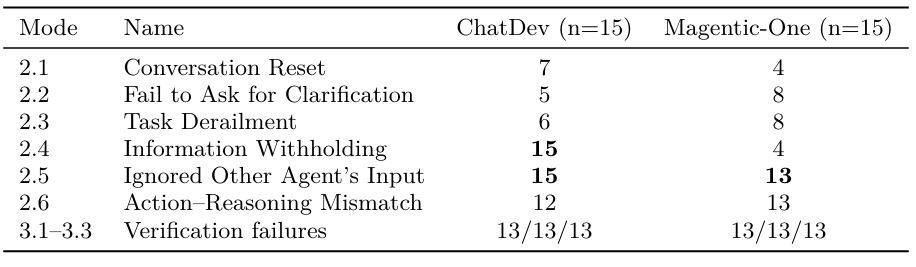

Three Magentic-One runs stuck with us because they fail in the same characteristic way. The Orchestrator *does not know its collaborator's status* (it re-issues transcript-extraction instructions ~8 times to a WebSurfer that can't open YouTube transcripts), *does not know the answer is ready* (the WebSurfer shows it the desired blog post and it never clicks it), and *does not know it is wrong* (it knows an answer is fake, but running out of turns, it "panics" and uses it anyway). In [AutoGen](https://arxiv.org/abs/2308.08155) group chat on GAIA, agents often hide context that could have been useful (internal suspicions, insights), agents make assumptions that then change the perception of the whole MAS, and agent frustration after a long number of turns leads to "panic" and hallucinations.

Code: [`reproduction/`](reproduction/), [`task_selection/`](task_selection/).

## Framing: messages are lossy compressions of epistemic state

When agent A communicates with agent B, its message is generated from an underlying epistemic state (beliefs, assumptions, and confidence that A holds but does not necessarily write down). We model this state as a latent variable *Z*, with the transmitted message *M* = *f*(*Z*). The verbalization function *f* is lossy: *M* under-determines *Z*, so parts of A's state never reach B.

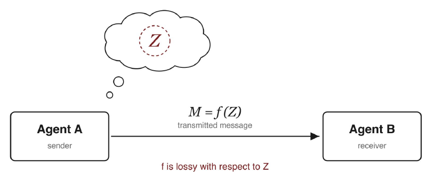

So the agents' contexts are not fully shared, on two levels: *explicit asymmetry* (different contexts, texts, working traces) and *implicit asymmetry* (different beliefs, hidden thinking). We probe each with a controlled experiment.

## Two controlled experiments

### Explicit asymmetry: lost-in-propagation ([`chainloss/`](chainloss/))

A relay chain of agents solves [FanOutQA](https://arxiv.org/abs/2402.14116) under the same total token budget at every chain length N. Performance first rises (two agents beat one) and then declines, at constant total context: each hand-off passes through the lossy *f*, and the losses compound.

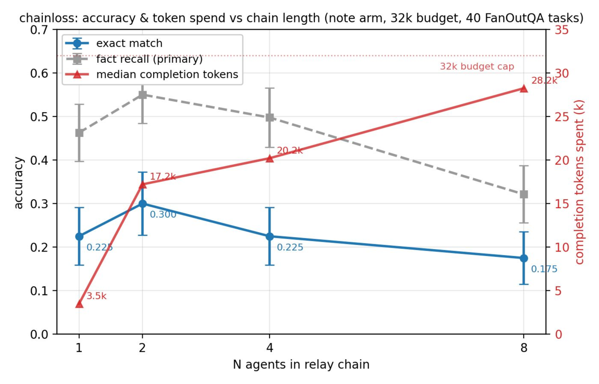

### Implicit asymmetry: belief injection ([`beliefrelay/`](beliefrelay/))

We inject beliefs into the system prompts of a 3-agent relay, hidden from the other agents, in three variants: *probe* (each agent gets 3 different beliefs), *homo* (each agent gets the same 3 beliefs), and *none* (no belief injection). FEVER is the headline — homo > none > probe: agents holding the same hidden beliefs outperform belief-free agents, and agents holding different hidden beliefs underperform them. On MATH-L5 the deltas are not significant, which could be attributed to the tasks being much more objective, so beliefs have less influence.

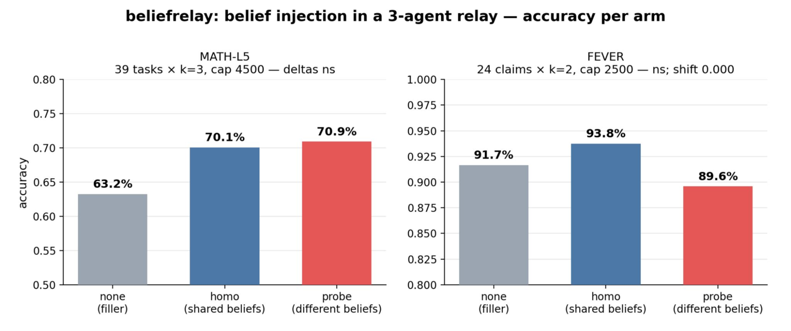

## Proposed mechanisms: a belief table and a belief board

The belief system is about making first-order theory of mind easier: instead of B having to infer what A thinks, A just tells B its opinions directly. We built two MAS-agnostic v0 prototypes.

The **belief table**: an auxiliary observer LLM reads A's full trace at each hand-off and writes a short, revisable ledger of typed entries (observation vs. belief), each with an object, a claim, a confidence, and an author. Some objects are objective (a found fact, acting like shared memory); others are subjective (if A loses hope near the end, that warns B its answer is probably a hallucination).

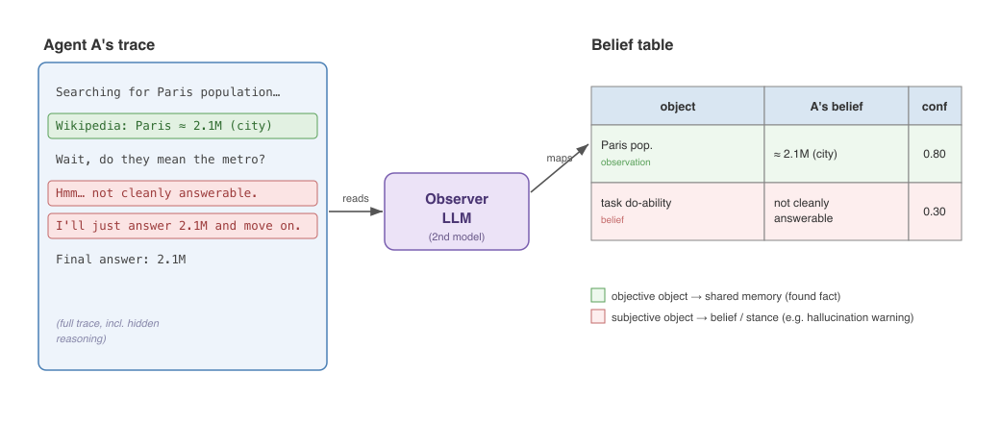

The **belief board** is the simpler, more direct version: instead of a second model reconstructing A's beliefs after the fact, we hand A the tools to jot down its beliefs itself, live, as it works, via `add_belief` / `revise_belief`. Nothing is ever deleted: a revision appends a corrected entry pointing back at the old one, so B sees not only what A currently believes, but that it changed its mind.

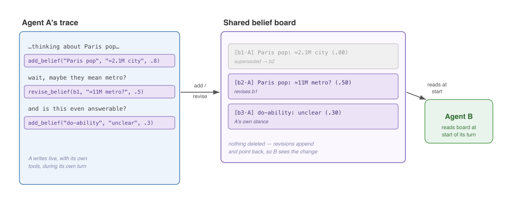

## Evaluation: two geometries of asymmetry ([`duet/`](duet/))

Our system relies on information asymmetry, so we develop two simplified MAS that reflect its two types, temporal (**Relay**) and spatial (**Hub**), each agent with an internal ReAct loop before communicating with other agents.

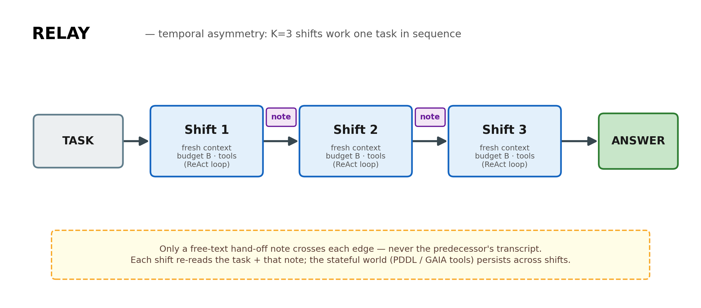

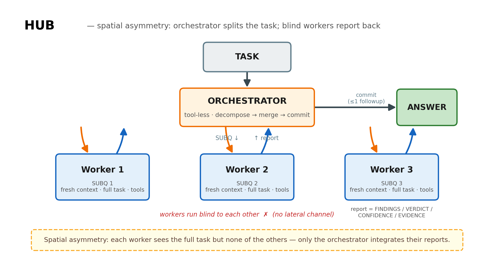

Because the belief mechanisms target theory-of-mind issues rather than factual recall, the baselines are also ToM-flavored: *full* (just keep all logs, for full transparency), *sop* (structured verdict / evidence / next-steps hand-offs), *down* (debate on demand), *extract* (the observer-style belief table), and *board*, run across GAIA, PDDL, FEVER-compound, FanOutQA, and GPQA-Diamond.

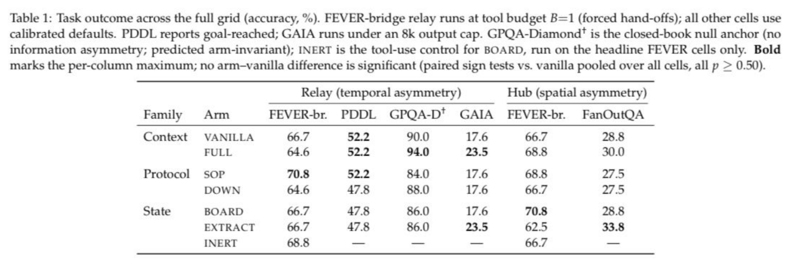

The honest result so far: across the full grid, no arm beats vanilla significantly, our board included. At this scale, lightweight text-level belief sharing does not yet move the needle.

## Ongoing: reading Z directly

One reading of the null is that the treatment is applied at the wrong level: any mechanism that asks A to *verbalize* its state is itself downstream of the lossy *f*. So the current work tries to expose more of *Z* without going through the message channel.

**Probing with random questions** ([`chainloss/REPORT_E1_randq.md`](chainloss/REPORT_E1_randq.md)): B asks A a couple of questions that are deliberately *unrelated* to the task. Because A answers from inside its working context, every answer is conditioned on *Z*, so off-topic answers can leak information from the part of *Z* that *M* left unexposed.

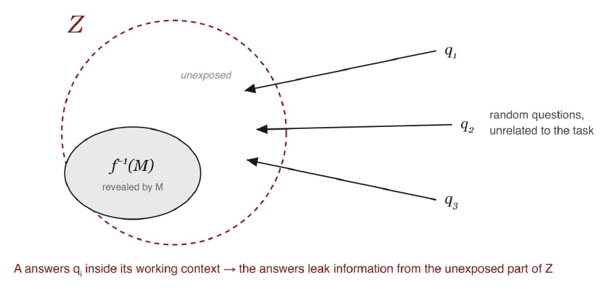

**Reading Z with the J-lens** ([`jspace/`](jspace/)): the J-lens reads A's global workspace — the set of concepts A is silently entertaining at a given moment. The lens yields a readout g(*Z*), the top-k workspace tokens at a middle layer, including never-verbalized ones, which we compress into a short structured blurb and pass to B alongside *M*, bypassing the lossy *f* entirely.

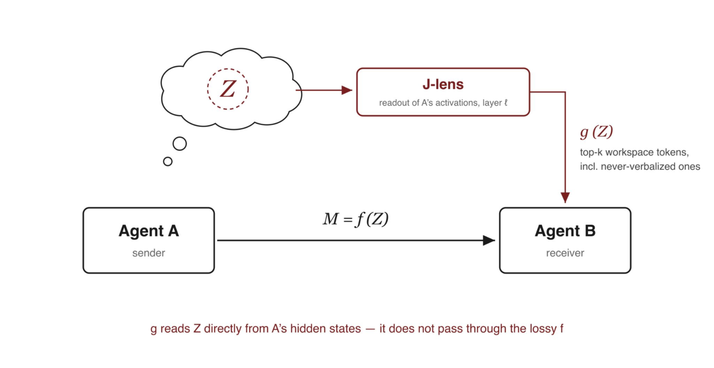

## Repo layout

- [`reproduction/`](reproduction/), [`task_selection/`](task_selection/) — native ChatDev 1.0 + Magentic-One harness and task picking for the GAIA case studies.
- [`chainloss/`](chainloss/) — the lost-in-propagation relay experiment, plus the random-questions probing arm.
- [`beliefrelay/`](beliefrelay/) — belief injection in a 3-agent relay; [`beliefdial/`](beliefdial/) — lab test for belief transmission across a single A–B edge.
- [`duet/`](duet/) — the two-geometry (Relay / Hub) harness and the mechanism sweep behind Table 1.
- [`handoff/`](handoff/) — a generated lab benchmark for the single A→B edge; [`synchandoff/`](synchandoff/) — belief/hand-off protocols on out-of-sync repair episodes.
- [`jspace/`](jspace/) — the J-lens workspace readout on a 2-shift relay.
- [`benchmarks/`](benchmarks/) — framework-agnostic task data in one uniform schema.
- [`camel/`](camel/), [`macnet/`](macnet/), [`dylan/`](dylan/) — canonical MAS baselines (the latter two via the [G-Memory](https://arxiv.org/abs/2506.07398) harness).
- [`figures/`](figures/) — diagrams; `figures/readme/` holds the figures above that come from our internal progress slides.
- [`references/`](references/) — papers.

---

If you use or build on this work, please cite it.
